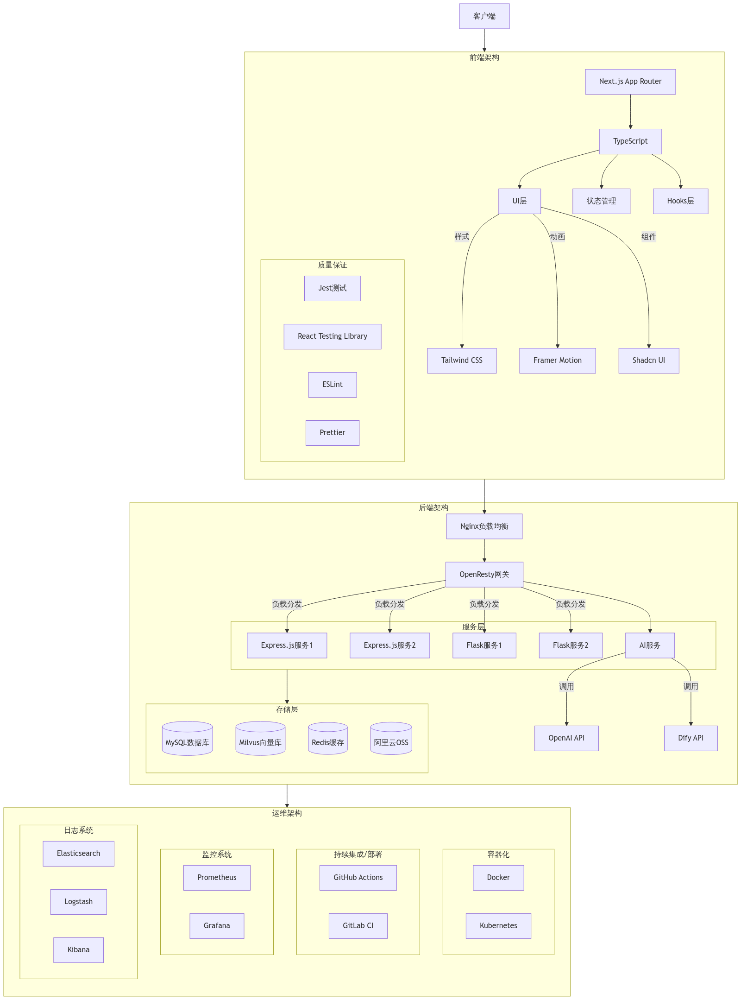

# AI 驱动的全栈开发助手

一个基于 AI 的全栈开发辅助系统,通过自然语言交互方式,帮助开发团队快速构建高质量的应用。

## 核心功能

### 1. 售前支持

- 历史投标检索与分析
- 品牌新闻分析
- 投标方案评估
- 演讲稿生成与演练

### 2. 需求分析

- 业务需求分析
- 基于设计稿的代码生成
- 快速需求文档撰写
- 产品文档生成

### 3. 开发辅助

- 前端框架代码生成
- 宝塔 UNEX/LIGHT 配置
- UNEX 接口生成与对接
- 测试用例编写
- 测试脚本生成

### 4. 运营支持

- 自然语言页面内容生成
- 客服话术演练

## 技术特性

### 框架集成

- ACE/UNEX 框架集成
- 多语言支持 (Vue, React, Python, Node.js, Java)
- CMS 框架标准集成 (WordPress, Drupal)

### 知识沉淀

- 售前 BD 方法论沉淀
- 开发组件库沉淀
- 技术经验沉淀

### AI 调优

- 输出模板调优
- 工作流链路调优
- 底层思维链调优

## 工作区规划

### 产品文档区

- 左侧对话区
- 右侧文本编辑区
- 通过对话自动填充文档

### 前端组件区

- 左侧对话区
- 右侧代码区

### 数据库区

- 左侧对话区
- 右侧 SQL 语法区

### 后端开发区

- 左侧对话区
- 右侧语言选择 (JAVA/PYTHON) 和代码区

## 开发脚本

### 构建和开发

- `dev` - 启动开发服务器
- `build` - 构建生产版本
- `analyze` - 分析打包体积

### 测试相关

- `typecheck` - 检查 TypeScript 类型
- `lint` - 运行 ESLint 检查
- `jest` - 运行单元测试
- `test` - 运行所有测试和检查

### 其他工具

- `storybook` - 启动 Storybook
- `prettier:write` - 格式化代码

### 前端技术栈

- **框架**: Next.js (App Router)
- **语言**: TypeScript
- **样式**: Tailwind CSS
- **动画**: Framer Motion
- **测试**: Jest & React Testing Library
- **代码质量**: ESLint & Prettier

### 后端技术栈

- **框架**: Express.js (Node.js) / Flask (Python)
- **语言**: Node.js / Python
- **数据库**: MySQL (关系型数据库)
- **向量数据库**: Milvus
- **缓存**: Redis
- **网关**: OpenResty
- **容器化**: Docker

### 部署技术栈

- **容器化**: Docker
- **容器编排**: Kubernetes (可选)
- **CI/CD**: GitHub Actions / GitLab CI
- **监控**: Prometheus & Grafana
- **日志管理**: ELK Stack (Elasticsearch, Logstash, Kibana)
- **负载均衡**: Nginx
- **服务发现**: Consul
- **配置中心**: Nacos
- **消息队列**: RabbitMQ
- **服务网格**: Istio (可选)

## 贡献指南

欢迎提交 Pull Request 和 Issue。在提交代码前,请确保:

1. 通过所有测试
2. 符合代码规范
3. 更新相关文档
4. 添加必要的测试用例

## 许可证

APACHE 3.0 License

# Todo list

- 增加组件上传功能
- 增加组件验证逻辑
- 增加代码预览功能
- 优化组件库
- 增加页面部分的预览功能

# Architecture Diagram




# 后端 CSV excel 数据对话架构

```
graph LR
    A[前端] --> B[文件上传]
    B --> C[Python 后端]
    A --> D[对话请求]
    D --> C
    C --> E[数据处理/Pandas]
    C --> F[LLM 分析]
    C --> G[返回结果]
    G --> H[前端可视化]
```

更强大的数据处理能力
使用 Pandas 进行高效的数据操作
更好的内存管理
复杂计算更快速
更好的扩展性
易于集成其他 Python 数据科学库
可以使用 NumPy, SciPy 等进行高级分析
支持机器学习模型集成
前端职责更清晰
专注于用户交互和数据展示
减少前端数据处理负担
更好的性能表现
注意事项
数据传输
考虑大文件上传的处理
实现数据压缩
添加进度提示
状态管理
后端需要管理用户会话
考虑数据持久化存储
实现数据缓存机制
错误处理
添加请求超时处理
实现错误重试机制
提供友好的错误提示 4. 安全性
添加文件类型验证
实现数据访问控制
防止 SQL 注入等安全问题

LLM 的主要作用
意图理解: 解析用户自然语言查询
分析规划: 确定数据操作步骤
可视化建议: 推荐合适的图表类型
结果解释: 生成数据分析解释
